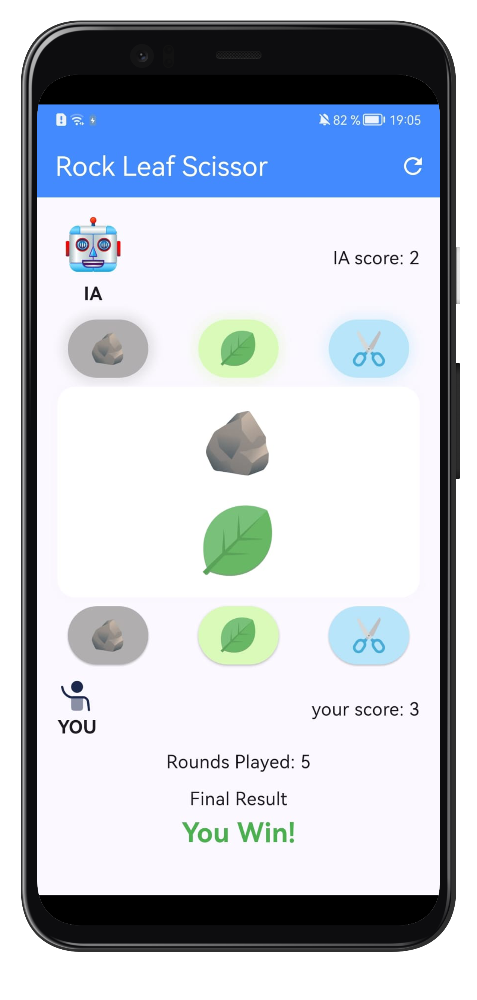

# 🪨🍃✂️ Rock Leaf Scissor

A simple mobile game built with **Flutter** where the player competes against the computer in a classic **Rock – Leaf – Scissor** match.

## 🚀 Features

* Choose between **Rock**, **Leaf**, or **Scissor**
* The computer randomly selects its move
* Results displayed after each round:

  * `"You win"` if the player beats the computer
  * `"You lost"` if the computer wins
* Matches end when either the player or the computer reaches **3 points**
* Ties (`draw`) do not add to the score

## 📱 Preview (screenshots to be added)

*(You can insert app screenshots here, e.g., in an `/assets/screenshots/` folder)*



## 🛠️ Tech Stack

* **Flutter (Dart)**
* **Material Design** for the UI
* Runs on **Android** & **iOS**

## ⚙️ Installation & Run

1. Clone the repository:

   ```bash
   git clone https://github.com/dididnk/rock_leaf_scissor.git
   cd rock_leaf_scissor
   ```

2. Get the dependencies:

   ```bash
   flutter pub get
   ```

3. Run the app:

   ```bash
   flutter run
   ```

## 📂 Project Structure

```bash
lib/
 ├─ main.dart        # Entry point of the app
 ├─ pages/
 │   └─ home_page.dart  # Main game page
```
