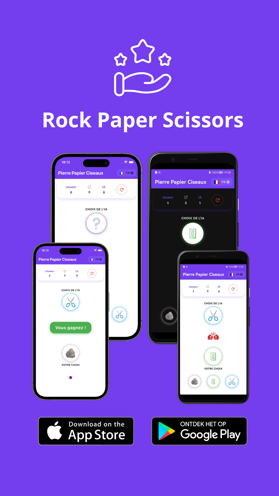

# 🪨🍃✂️ Rock Paper Scissors - Flutter Mobile Game

An elegant mobile game developed with **Flutter** where you compete against the computer in thrilling matches of **Rock – Paper – Scissors**.

## 🎯 Advanced Features

* **Intuitive interface** with Material Design 3 and smooth animations
* **Balanced gameplay**: AI generates random choices to ensure fair matches
* **Detailed results display** after each round with visual indicators
* **Competition mode**: 1 vs 1 and first to reach **3 points** wins the game
* **Smart tie management**: draws do not affect the score
* **Responsive design** optimized for mobile (Android & iOS)

## 📸 Preview



*(Screenshots available in the `/screenshots/` folder)*

## 🏗️ Technical Architecture

* **Flutter 3.0+** (Dart 2.17+)
* **State Management**: Native state management with setState for maximum simplicity
* **UI/UX**: Material Design 3 with custom theme and implicit animations
* **Compatibility**: Native Android & iOS support with optimized performance

## 🚀 Quick Start

1. Clone the repository:

   ```bash
   git clone https://github.com/dididnk/rock_paper_scissors.git
   cd rock_paper_scissors
   ```

2. Install dependencies:

   ```bash
   flutter pub get
   ```

3. Run the app:

   ```bash
   flutter run
   ```

## 📂 Project Structure

```bash
lib/
 ├─ main.dart                 # Entry point and application configuration
 ├─ providers/
 │   └─ local_provider.dart      # Language change management
 ├─ utils/
 │   ├─ theme/
 │       ├─ app_colors.dart     
 │       ├─ app_theme.dart     
 │   ├─ global_constances.dart
 ├─ widgets/
 │   ├─ custom_button.dart   # Selection button (rock, paper, scissors)
 │   ├─ score_board_widget.dart      # Score and results display
 │   ├─ final_result_widget.dart      # Final score display
 │   └─ language_widget.dart     # Language selection widget
 └─ pages/
     └─ home_page.dart       # Main screen with widget composition
```

## 🎮 How to Play

1. Press one of the three buttons to make your choice
2. The computer instantly generates its move
3. The result displays with a clear message (Win, Loss, or Draw)
4. The score updates automatically
5. The first to reach 3 points wins the game!

## 📝 Upcoming Improvements

- [ ] Local multiplayer mode
- [ ] Match history
- [ ] Sound effects and vibrations
- [ ] Customizable themes (currently applies default theme)
- [ ] Variable difficulty mode (adaptive AI)

---

**Supported languages: 🇫🇷, 🇺🇸, 🇪🇸, 🇩🇪, 🇮🇹, 🇵🇹, 🇷🇺, 🇨🇳.**